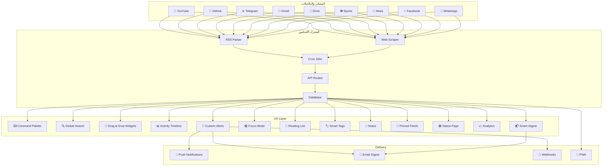
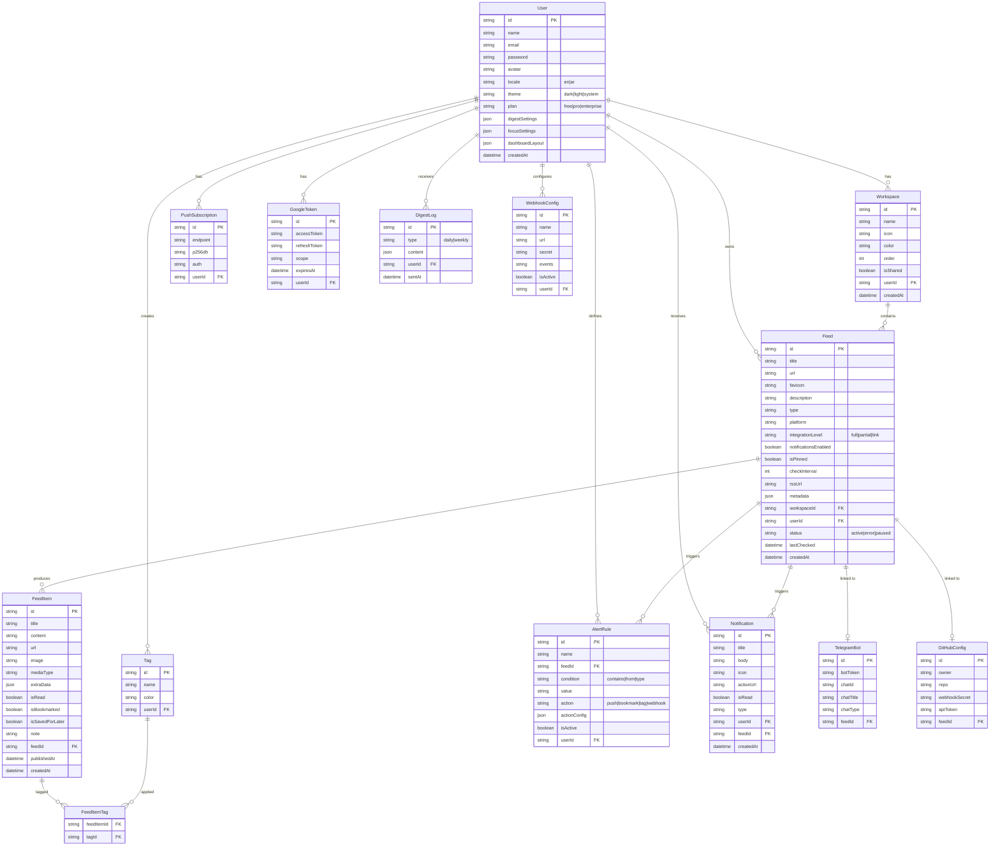

# 🚀 Orbita — الخطة النهائية الشاملة

## القرارات النهائية

| القرار | الاختيار |
|--------|----------|
| المصادقة | المرحلة 5 |
| اللغة | EN + AR (i18n + RTL) |
| قاعدة البيانات | SQLite → PostgreSQL |
| معمارية التكامل | 3 مستويات (Full / Partial / Link) |
| ترتيب المراحل | Foundation → Core → Notifications → Advanced → Market |

---

## 💰 نموذج التسعير — Free vs Pro vs Enterprise

### الخطط الثلاثة

```
┌──────────────────┬──────────────────┬──────────────────┐
│   🆓 Free         │   ⭐ Pro          │   🏢 Enterprise   │
│   $0/month        │   $9/month       │   $29/month      │
│                    │                  │                  │
│   للأفراد          │   للمحترفين       │   للفرق والشركات  │
│   والتجربة        │   والمطورين       │                  │
└──────────────────┴──────────────────┴──────────────────┘
```

---

### 📊 مقارنة الميزات التفصيلية

#### 🔗 المصادر والمساحات (Feeds & Workspaces)

| الميزة | 🆓 Free | ⭐ Pro | 🏢 Enterprise |
|--------|---------|--------|---------------|
| عدد المصادر (Feeds) | **5** | **لا حدود ∞** | **لا حدود ∞** |
| مساحات العمل (Workspaces) | **2** | **لا حدود ∞** | **لا حدود ∞** |
| Quick Links (روابط مباشرة) | ✅ | ✅ | ✅ |
| كشف تلقائي للرابط | ✅ | ✅ | ✅ |
| جلب Favicons تلقائياً | ✅ | ✅ | ✅ |
| FeedCard مع Preview | ✅ | ✅ | ✅ |
| ألوان وأيقونات مخصصة | ✅ | ✅ | ✅ |

#### 🔌 التكاملات (Integrations)

| الميزة | 🆓 Free | ⭐ Pro | 🏢 Enterprise |
|--------|---------|--------|---------------|
| 🔴 YouTube (RSS) | ✅ | ✅ | ✅ |
| 🐙 GitHub (RSS + Webhooks) | ✅ | ✅ | ✅ |
| 📰 مواقع أخبار (RSS) | ✅ | ✅ | ✅ |
| ⚽ مواقع رياضية (RSS) | ✅ | ✅ | ✅ |
| 📘 Facebook (Quick Link) | ✅ | ✅ | ✅ |
| 💬 WhatsApp (Quick Link) | ✅ | ✅ | ✅ |
| ✈️ Telegram Bot | ❌ | ✅ | ✅ |
| 📧 Gmail Integration | ❌ | ✅ | ✅ |
| 📁 Google Drive | ❌ | ✅ | ✅ |
| 📘 Facebook RSS (محتوى) | ❌ | ✅ | ✅ |
| ⚽ Sports APIs (نتائج حية) | ❌ | ✅ | ✅ |
| 📘 Facebook Graph API | ❌ | ❌ | ✅ |

#### 🔔 الإشعارات (Notifications)

| الميزة | 🆓 Free | ⭐ Pro | 🏢 Enterprise |
|--------|---------|--------|---------------|
| إشعارات داخل الداشبورد | ✅ | ✅ | ✅ |
| عدد الإشعارات المحفوظة | **آخر 50** | **لا حدود ∞** | **لا حدود ∞** |
| Push Notifications (المتصفح) | ✅ (**3** مصادر) | ✅ (**الكل**) | ✅ (**الكل**) |
| ⭐ Smart Digest (يومي) | ❌ | ✅ | ✅ |
| ⭐ Smart Digest (أسبوعي) | النسخة الأساسية | النسخة الكاملة | النسخة الكاملة |
| ⭐ Custom Alert Rules | ❌ | ✅ | ✅ |
| ⭐ Email Digest | ❌ | ✅ | ✅ |
| ⭐ Webhook Notifications | ❌ | ❌ | ✅ |

#### ⌨️ تجربة المستخدم (UX)

| الميزة | 🆓 Free | ⭐ Pro | 🏢 Enterprise |
|--------|---------|--------|---------------|
| Dark / Light Mode | ✅ | ✅ | ✅ |
| العربي + الإنجليزي (i18n) | ✅ | ✅ | ✅ |
| ⌨️ Command Palette (Ctrl+K) | ✅ | ✅ | ✅ |
| ⌨️ Keyboard Shortcuts | ✅ (أساسي) | ✅ (كامل) | ✅ (كامل) |
| 📑 Reading List | ✅ (**10** عناصر) | ✅ (**لا حدود**) | ✅ (**لا حدود**) |
| 📊 Activity Timeline | ✅ (**آخر 24 ساعة**) | ✅ (**لا حدود**) | ✅ (**لا حدود**) |
| 🔍 Global Search | ✅ | ✅ | ✅ |
| 🎧 Focus Mode | ❌ | ✅ | ✅ |
| 🧩 Drag & Drop Widgets | ❌ | ✅ | ✅ |
| 📌 Pinned Feeds | ✅ (**3**) | ✅ (**لا حدود**) | ✅ (**لا حدود**) |
| 🎓 Onboarding Wizard | ✅ | ✅ | ✅ |
| 🟢 Status Page | ✅ | ✅ | ✅ |
| PWA (تثبيت كتطبيق) | ✅ | ✅ | ✅ |

#### 🏢 ميزات الفرق والشركات (Team & Enterprise)

| الميزة | 🆓 Free | ⭐ Pro | 🏢 Enterprise |
|--------|---------|--------|---------------|
| عدد المستخدمين | **1** | **1** | **لا حدود ∞** |
| مشاركة Workspaces مع الفريق | ❌ | ❌ | ✅ |
| أدوار وصلاحيات (Roles) | ❌ | ❌ | ✅ |
| 📄 Export Reports (PDF/CSV) | ❌ | ❌ | ✅ |
| 🔗 API Access | ❌ | ❌ | ✅ |
| 🧩 Browser Extension | ❌ | ✅ | ✅ |
| ⚙️ Webhook/Zapier Integration | ❌ | ❌ | ✅ |
| Custom Branding (لوجو خاص) | ❌ | ❌ | ✅ |
| Priority Support | ❌ | ✅ (Email) | ✅ (Chat + Email) |

---

### 💡 فلسفة التسعير

> [!TIP]
> **القاعدة الذهبية:** الخطة المجانية يجب أن تكون **مفيدة بما يكفي** لإبهار المستخدم، لكن **محدودة بما يكفي** لجعله يريد المزيد.

```
🆓 Free يقول:  "واو، ده تطبيق ممتاز! بس 5 مصادر مش كفاية..."
⭐ Pro يقول:   "الآن عندي كل شيء — Telegram, Gmail, Drive, لا حدود!"
🏢 Enterprise: "فريقي كله يقدر يستخدمه + تقارير + API"
```

**Upgrade Triggers (ما يدفع المستخدم للترقية):**
- Free → Pro: **الوصول للحد الأقصى (5 feeds)** أو **الحاجة لـ Telegram/Gmail/Drive**
- Pro → Enterprise: **الحاجة لمشاركة الفريق** أو **Export Reports** أو **API Access**

---

## ⭐ ميزات إضافية جديدة (7 ميزات)

بالإضافة للـ 12 ميزة السابقة، هذه **7 ميزات إضافية** لنظام احترافي شامل:

---

### 🏷️ 13. Smart Tags — تصنيف ذكي بالوسوم

> **مستوحى من:** Notion, Raindrop.io, Gmail Labels

```
┌─────────────────────────────────────────┐
│ 🏷️ Tags                                 │
│                                          │
│ [🔥 urgent] [📚 study] [💻 frontend]   │
│ [📊 data] [🎯 todo] [⭐ important]     │
│                                          │
│ Auto-tags (AI-suggested):               │
│   "React 19 Features" → 💻 frontend     │
│   "Final Exam Schedule" → 📚 study      │
│   "Gold Price Alert" → 💰 finance       │
└─────────────────────────────────────────┘
```

**ما يوفره:**
- ✅ وسوم يدوية على أي FeedItem
- ✅ فلترة بالوسوم عبر كل المصادر
- ✅ ألوان مخصصة لكل وسم
- ✅ مستقبلاً: Auto-tagging بالذكاء الاصطناعي

> **Free:** 5 وسوم | **Pro:** لا حدود | المرحلة: Phase 2

---

### 🚨 14. Custom Alert Rules — قواعد تنبيه مخصصة

> **مستوحى من:** IFTTT, Google Alerts, Zapier

```
┌─────────────────────────────────────────┐
│ 🚨 Alert Rules                           │
│                                          │
│ Rule 1: "Gold Price"                     │
│   IF: Feed "Gold News" contains "ارتفع"  │
│   THEN: 🔔 Push notification (urgent)   │
│                                          │
│ Rule 2: "Professor Email"               │
│   IF: Gmail from "@university.edu"       │
│   THEN: 🔔 Push + ⭐ Auto-bookmark     │
│                                          │
│ Rule 3: "New Release"                    │
│   IF: GitHub "my-project" has release    │
│   THEN: 🔔 Push + 🏷️ Tag "deploy"      │
│                                          │
│ [+ Add New Rule]                         │
└─────────────────────────────────────────┘
```

**ما يوفره:**
- ✅ إشعارات ذكية مبنية على **كلمات مفتاحية**
- ✅ إشعارات مبنية على **المرسل** (Gmail)
- ✅ إجراءات تلقائية: تثبيت، وسم، أولوية عالية
- ✅ قواعد IF/THEN بسيطة وقوية

> **Pro فقط** | المرحلة: Phase 4

---

### 🔗 15. Webhook & Zapier Integration — تكامل خارجي

> **مستوحى من:** Slack, Discord, n8n

```
┌─────────────────────────────────────────┐
│ 🔗 Integrations                          │
│                                          │
│ Outgoing Webhooks:                       │
│   → Send new items to Slack channel      │
│   → Send alerts to Discord bot           │
│   → Push data to Google Sheets           │
│   → Trigger Zapier/Make workflow         │
│                                          │
│ Incoming Webhooks:                       │
│   → Receive custom events via URL         │
│   → Connect any service to Orbita      │
└─────────────────────────────────────────┘
```

**ما يوفره:**
- ✅ ربط Orbita مع أي خدمة خارجية
- ✅ إرسال الإشعارات لـ Slack/Discord/Teams
- ✅ Zapier/Make يفتح آلاف التكاملات
- ✅ **ميزة Enterprise قاتلة** — الشركات تدفع لهذا

> **Enterprise فقط** | المرحلة: Phase 5

---

### 📝 16. Notes & Annotations — ملاحظات على المحتوى

> **مستوحى من:** Hypothesis, Pocket Premium, Notion

```
على أي FeedItem:
┌─────────────────────────────────────────┐
│ 🔴 CS50 Lecture 8 — SQL                  │
│ Published: April 13, 2026                │
│                                          │
│ 📝 Your Notes:                           │
│ ┌───────────────────────────────────────┐│
│ │ مهم جداً - يحتاج مراجعة قبل الامتحان ││
│ │ الدقيقة 23:00 — شرح JOIN مهم         ││
│ └───────────────────────────────────────┘│
│                                          │
│ 🏷️ Tags: [📚 study] [⭐ important]     │
└─────────────────────────────────────────┘
```

**ما يوفره:**
- ✅ ملاحظات نصية على أي عنصر محفوظ
- ✅ ربط الملاحظات بالوسوم
- ✅ بحث في الملاحظات عبر Global Search
- ✅ يحول Orbita من "قارئ" إلى "قاعدة معرفة شخصية"

> **Free:** 10 ملاحظات | **Pro:** لا حدود | المرحلة: Phase 3

---

### 📱 17. Multi-Device Sync — مزامنة عبر الأجهزة

> **مستوحى من:** كل تطبيق حديث**

```
┌─────────────────────────────────────────┐
│ 📱 Devices                               │
│                                          │
│ 💻 Desktop — Chrome — Last active: now   │
│ 📱 Mobile  — Safari — Last active: 2h   │
│ 📱 Tablet  — Firefox — Last active: 1d  │
│                                          │
│ ✅ All data synced automatically          │
│ ✅ Read state synced across devices       │
│ ✅ Notification preferences per device    │
└─────────────────────────────────────────┘
```

**ما يوفره:**
- ✅ نفس البيانات على كل الأجهزة
- ✅ حالة "مقروء" تتزامن (مثل Gmail)
- ✅ إعدادات إشعارات مختلفة حسب الجهاز
- ✅ يعمل تلقائياً بحكم أنه Web App + PWA

> **متاح للكل** (ضمن الحساب الواحد) | المرحلة: Phase 5

---

### 📌 18. Pinned Feeds — تثبيت المصادر المهمة

> **مستوحى من:** Telegram Pinned, Slack Starred

```
┌──── Sidebar ─────────────────────────────┐
│ 📌 Pinned                                │
│   🔴 CS50 Channel                        │
│   🐙 my-project                          │
│   📧 University Email                    │
│ ─────────────────────                    │
│ 💼 Work                                  │
│   📘 Company FB Page                     │
│   ...                                    │
└──────────────────────────────────────────┘
```

**ما يوفره:**
- ✅ الوصول الفوري للمصادر الأهم
- ✅ تظهر في أعلى الـ Sidebar دائماً
- ✅ ترتيب مخصص بالسحب والإفلات
- ✅ بديل عملي عن فتح عدة تابات

> **Free:** 3 pinned | **Pro:** لا حدود | المرحلة: Phase 2

---

### 📈 19. Analytics Dashboard — إحصائيات استخدامك

> **مستوحى من:** Screen Time (iOS), GitHub Insights

```
┌─────────────────────────────────────────┐
│ 📈 Your Activity This Week               │
│                                          │
│ Most Active Sources:                     │
│   1. 🔴 YouTube (23 videos watched)      │
│   2. 🐙 GitHub (15 commits tracked)      │
│   3. 📧 Gmail (42 emails received)       │
│                                          │
│ 📊 Feed Activity Chart                   │
│   ████████████░░░ YouTube                │
│   ██████████░░░░░ GitHub                 │
│   ████████░░░░░░░ Sports                 │
│   ███░░░░░░░░░░░░ News                   │
│                                          │
│ 🔔 Notifications: 156 received, 89% read │
│ ⏰ Peak Activity: 9 AM - 11 AM           │
│ 📑 Saved Items: 12 this week             │
└─────────────────────────────────────────┘
```

**ما يوفره:**
- ✅ فهم أي المصادر أكثر نشاطاً
- ✅ تحليل عادات الاستخدام
- ✅ charts تفاعلية (Recharts)
- ✅ ميزة "Self-Awareness" تزيد Engagement

> **Free:** أساسي | **Pro:** كامل | المرحلة: Phase 4

---

## 📊 الملخص الشامل — كل الميزات (19 ميزة + الأساسيات)

### ⚙️ ميزات أساسية (متاحة للجميع)

| # | الميزة | الوصف |
|---|--------|-------|
| — | CRUD Feeds | إضافة/تعديل/حذف المصادر |
| — | CRUD Workspaces | إنشاء وإدارة مساحات العمل |
| — | Auto-detect Links | كشف تلقائي لنوع الرابط |
| — | Favicons | جلب أيقونة الموقع تلقائياً |
| — | Quick Links | حفظ أي رابط (Facebook, WhatsApp, ...) |
| — | Dark/Light Mode | المظهر الداكن والفاتح |
| — | EN + AR (i18n + RTL) | دعم اللغتين |
| — | YouTube RSS | متابعة قنوات يوتيوب |
| — | GitHub RSS | متابعة مشاريع GitHub |
| — | News/Sports RSS | متابعة أخبار ورياضة |
| — | Internal Notifications | إشعارات داخل الداشبورد |
| — | Push Notifications | إشعارات المتصفح (3 مصادر) |
| — | PWA | تثبيت كتطبيق |

### ⭐ ميزات محسّنة (19 ميزة)

| # | الميزة | 🆓 Free | ⭐ Pro | 🏢 Enterprise | المرحلة |
|---|--------|---------|--------|---------------|---------|
| 1 | ⌨️ Command Palette | ✅ | ✅ | ✅ | Phase 2 |
| 2 | 📬 Smart Digest | أسبوعي فقط | يومي + أسبوعي | يومي + أسبوعي + بريد | Phase 3 |
| 3 | 🎓 Onboarding Wizard | ✅ | ✅ | ✅ | Phase 4 |
| 4 | 🧩 Drag & Drop Widgets | ❌ | ✅ | ✅ | Phase 4 |
| 5 | 🎧 Focus Mode | ❌ | ✅ | ✅ | Phase 4 |
| 6 | 📑 Reading List | 10 items | ∞ | ∞ | Phase 2 |
| 7 | ⌨️ Keyboard Shortcuts | أساسي | كامل | كامل | Phase 2 |
| 8 | 📊 Activity Timeline | 24 ساعة | ∞ | ∞ | Phase 3 |
| 9 | 🟢 Status Page | ✅ | ✅ | ✅ | Phase 4 |
| 10 | 🔍 Global Search | ✅ | ✅ | ✅ | Phase 3 |
| 11 | 📄 Export Reports | ❌ | ❌ | ✅ PDF + CSV | Phase 5 |
| 12 | 🧩 Browser Extension | ❌ | ✅ | ✅ | Phase 5 |
| 13 | 🏷️ Smart Tags | 5 tags | ∞ | ∞ | Phase 2 |
| 14 | 🚨 Custom Alert Rules | ❌ | ✅ | ✅ | Phase 4 |
| 15 | 🔗 Webhook/Zapier | ❌ | ❌ | ✅ | Phase 5 |
| 16 | 📝 Notes & Annotations | 10 notes | ∞ | ∞ | Phase 3 |
| 17 | 📱 Multi-Device Sync | ✅ | ✅ | ✅ | Phase 5 |
| 18 | 📌 Pinned Feeds | 3 pins | ∞ | ∞ | Phase 2 |
| 19 | 📈 Analytics Dashboard | أساسي | كامل | كامل + فريق | Phase 4 |

---

## 📋 مراحل التنفيذ (الشاملة النهائية)

### Phase 1 — Foundation 🏗️
- [ ] مشروع Next.js + TypeScript
- [ ] CSS Design System (Dark/Light + RTL)
- [ ] Layout (Sidebar + Header + Main)
- [ ] Prisma + SQLite
- [ ] الصفحات الأساسية الفارغة
- [ ] i18n (EN + AR)

### Phase 2 — Core ⚙️
- [ ] CRUD Feeds + Workspaces
- [ ] كشف تلقائي للروابط + Favicons
- [ ] FeedCard + Preview
- [ ] Quick Links (FB, WA, أي موقع)
- [ ] ⌨️ Command Palette (`Ctrl+K`)
- [ ] 📑 Reading List
- [ ] ⌨️ Keyboard Shortcuts (أساسي)
- [ ] 🏷️ Smart Tags
- [ ] 📌 Pinned Feeds

### Phase 3 — Content & Notifications 🔔
- [ ] 🔴 YouTube RSS Integration
- [ ] 🐙 GitHub RSS + Webhooks Integration
- [ ] RSS Parser (أخبار + رياضة)
- [ ] Web Scraper (Cheerio)
- [ ] Cron Jobs (node-cron)
- [ ] إشعارات داخلية
- [ ] Push Notifications (Service Worker)
- [ ] 📬 Smart Digest (يومي/أسبوعي)
- [ ] 📊 Activity Timeline
- [ ] 🔍 Global Search
- [ ] 📝 Notes & Annotations

### Phase 4 — Advanced 🔌
- [ ] ✈️ Telegram Bot Integration
- [ ] 📧 Gmail Integration (OAuth2)
- [ ] 📁 Google Drive Integration (OAuth2)
- [ ] 📘 Facebook RSS (خدمة وسيطة)
- [ ] ⚽ Sports APIs
- [ ] 🎓 Onboarding Wizard
- [ ] 🧩 Drag & Drop Widgets
- [ ] 🎧 Focus Mode
- [ ] 🟢 Status Page
- [ ] 🚨 Custom Alert Rules
- [ ] 📈 Analytics Dashboard
- [ ] ⌨️ Keyboard Shortcuts (متقدم)
- [ ] PWA (manifest + service worker)

### Phase 5 — Market Ready 🚀
- [ ] نظام المصادقة (Login/Register)
- [ ] نظام الاشتراكات (Free/Pro/Enterprise)
- [ ] Landing Page تسويقية
- [ ] 📄 Export Reports (PDF/CSV)
- [ ] 🧩 Browser Extension
- [ ] 🔗 Webhook/Zapier Integration
- [ ] 📬 Email Digest (إرسال بريد)
- [ ] 📱 Multi-Device Sync
- [ ] 🏢 Team Features (مشاركة + أدوار)
- [ ] 📘 Facebook Graph API (Enterprise)
- [ ] API Documentation
- [ ] Deploy على Vercel

---

## 🏛️ المعمارية الشاملة



---

## 🗄️ قاعدة البيانات (النهائية)



---

## 🚀 Phase 6 — التطوير المستقبلي (Future Evolution)

> هذه ميزات **رسمية في خارطة الطريق** — موثقة ومجهزة للتنفيذ بعد إطلاق المرحلة 5.
> كل ميزة يمكن تنفيذها بشكل مستقل في أي وقت.

---

### 🤖 20. AI Summary — تلخيص ذكي بالذكاء الاصطناعي

> **مستوحى من:** Feedly AI, Readwise, ChatGPT

```
┌─────────────────────────────────────────┐
│ 🔴 CS50 Lecture 8 — SQL (45 min)        │
│                                          │
│ 🤖 AI Summary:                          │
│ • شرح أنواع JOIN الأربعة مع أمثلة عملية │
│ • كيفية استخدام INDEX لتسريع البحث       │
│ • تطبيق عملي على قاعدة بيانات طلاب      │
│                                          │
│ ⏱️ Reading time saved: ~40 minutes       │
│                                          │
│ [📺 Watch Full] [📑 Save] [🤖 Summarize]│
└─────────────────────────────────────────┘
```

**التفاصيل التقنية:**
- تكامل مع OpenAI API أو Google Gemini API
- تلخيص المقالات النصية (عبر محتوى RSS أو Cheerio)
- تلخيص وصف الفيديوهات (YouTube description + transcript)
- ملخص في 3-5 نقاط أساسية
- دعم التلخيص بالعربية والإنجليزية
- زر "Summarize" على أي FeedItem

**التسعير:** ❌ Free | ⭐ Pro (50 تلخيص/شهر) | 🏢 Enterprise (لا حدود)

**التقنيات:** OpenAI API / Google Gemini API

---

### 🤖 21. AI Auto-Tag — تصنيف تلقائي بالذكاء الاصطناعي

> **مستوحى من:** Gmail Smart Labels, Notion AI

```
┌─────────────────────────────────────────┐
│ 🤖 Auto-Tag Suggestions                 │
│                                          │
│ "React 19 New Features Released"         │
│   → 💻 frontend  ⭐ important           │
│                                          │
│ "Final Exam Schedule Updated"            │
│   → 📚 study  🔥 urgent                 │
│                                          │
│ "Gold Prices Rise 2.5%"                  │
│   → 💰 finance  📊 market               │
│                                          │
│ [✅ Accept All] [✏️ Edit] [❌ Dismiss]   │
└─────────────────────────────────────────┘
```

**التفاصيل التقنية:**
- يحلل عنوان ومحتوى كل FeedItem جديد
- يقترح وسوم تلقائياً بناءً على وسوم المستخدم الحالية
- يتعلم من قبول/رفض المستخدم للمقترحات
- يمكن تشغيله/إيقافه لكل مصدر

**التسعير:** ❌ Free | ⭐ Pro | 🏢 Enterprise

**التقنيات:** OpenAI API / Local ML model

---

### 📊 22. Team Analytics — إحصائيات الفريق

> **مستوحى من:** GitHub Insights, Slack Analytics

```
┌─────────────────────────────────────────┐
│ 📊 Team Activity — This Week             │
│                                          │
│ 👤 Ahmed: 45 items read, 12 saved        │
│ 👤 Sara:  32 items read, 8 saved         │
│ 👤 Omar:  28 items read, 15 saved        │
│                                          │
│ 📈 Team Trends:                          │
│   Most shared workspace: 💼 Work         │
│   Most active source: 🐙 GitHub          │
│   Avg. daily engagement: 35 items        │
│                                          │
│ [📄 Export Team Report]                   │
└─────────────────────────────────────────┘
```

**التفاصيل التقنية:**
- إحصائيات استخدام لكل عضو في الفريق
- تقارير أسبوعية/شهرية تلقائية
- مقارنة نشاط الأعضاء
- تصدير كـ PDF/CSV

**التسعير:** ❌ Free | ❌ Pro | 🏢 Enterprise فقط

---

### 📱 23. Mobile App — تطبيق موبايل أصلي

> **مستوحى من:** كل تطبيق SaaS ناجح

```
┌─────────────────────────────────────────┐
│ 📱 Orbita Mobile App                   │
│                                          │
│ Platform: iOS + Android                  │
│ Technology: React Native / Expo          │
│                                          │
│ Features:                                │
│ ✅ كل ميزات الويب                        │
│ ✅ إشعارات Native (أفضل من PWA)          │
│ ✅ Offline mode كامل                     │
│ ✅ Biometric login (بصمة/وجه)            │
│ ✅ Share Sheet (مشاركة لينك من أي تطبيق) │
│ ✅ Home Screen Widgets                    │
│                                          │
│ Distribution:                            │
│ 🍎 App Store + 🤖 Google Play            │
└─────────────────────────────────────────┘
```

**التفاصيل التقنية:**
- React Native مع Expo لتسريع التطوير
- نفس Backend (Next.js API Routes)
- Offline-first مع مزامنة ذكية
- Native push notifications أقوى من PWA
- Share Extension: مشاركة أي لينك من أي تطبيق مباشرة لـ Orbita

**التسعير:** ✅ متاح لكل الخطط (التطبيق مجاني، الميزات حسب الخطة)

**التقنيات:** React Native + Expo + AsyncStorage

---

### 🔄 24. Content Scheduling — جدولة نشر المحتوى

> **مستوحى من:** Buffer, Hootsuite, Later

```
┌─────────────────────────────────────────┐
│ 📝 Schedule New Post                     │
│                                          │
│ Content:                                 │
│ ┌───────────────────────────────────────┐│
│ │ 🚀 New release v2.0 is live!         ││
│ │ Check out the new features...         ││
│ └───────────────────────────────────────┘│
│                                          │
│ Post to:                                 │
│ ☑ 📘 Facebook Page                      │
│ ☑ 🐦 Twitter/X                          │
│ ☑ ✈️ Telegram Channel                   │
│ ☐ 🐙 GitHub (Release notes)             │
│                                          │
│ 📎 Attachments: [+ Add Image/Video]     │
│                                          │
│ ⏰ Schedule: April 15, 2026 — 9:00 AM   │
│ 🔄 Repeat: None | Daily | Weekly        │
│                                          │
│ [📅 Schedule] [📤 Post Now]              │
└─────────────────────────────────────────┘

📅 Calendar View:
┌──Mon──┬──Tue──┬──Wed──┬──Thu──┬──Fri──┐
│       │ 📘   │      │ 📘🐦│      │
│       │ 9AM  │      │ 2PM  │      │
└───────┴──────┴──────┴──────┴──────┘
```

**التفاصيل التقنية:**
- يحوّل Orbita من "قارئ" إلى "قارئ + ناشر" — يضاعف القيمة
- جدولة منشورات على: Facebook (Graph API), Twitter (API), Telegram (Bot API)
- Calendar view لرؤية كل المنشورات المجدولة
- صور ومرفقات
- تكرار (يومي/أسبوعي)
- تحليل أفضل وقت للنشر

**التسعير:** ❌ Free | ⭐ Pro (10 منشورات/شهر) | 🏢 Enterprise (لا حدود)

**التقنيات:** Platform APIs + node-cron + Queue system

---

### 💬 25. In-App Chat — دردشة الفريق حول المحتوى

> **مستوحى من:** Slack threads, Notion comments, Google Docs

```
┌─────────────────────────────────────────┐
│ 🔴 CS50 Lecture 8 — SQL                  │
│                                          │
│ 💬 Team Discussion (3 messages)          │
│ ┌───────────────────────────────────────┐│
│ │ 👤 Ahmed: هل حد شاف الجزء بتاع JOIN؟  ││
│ │ 👤 Sara: أيوا، مهم جداً للامتحان      ││
│ │ 👤 Omar: ممكن نعمل study session؟      ││
│ │                                        ││
│ │ [Type a message...]          [Send]    ││
│ └───────────────────────────────────────┘│
└─────────────────────────────────────────┘
```

**التفاصيل التقنية:**
- تعليقات ونقاشات على أي FeedItem
- مشابه لـ Threads في Slack
- إشعارات عند رد شخص على تعليقك
- يحوّل المتابعة من فردية إلى جماعية

**التسعير:** ❌ Free | ❌ Pro | 🏢 Enterprise فقط

**التقنيات:** WebSocket (Socket.io) أو Server-Sent Events

---

### 🌐 26. Public API — واجهة برمجة عامة

> **مستوحى من:** GitHub API, Twitter API, Slack API

```
┌─────────────────────────────────────────┐
│ 🌐 Orbita API v1                       │
│                                          │
│ Endpoints:                               │
│ GET  /api/v1/feeds          — كل المصادر│
│ POST /api/v1/feeds          — إضافة مصدر│
│ GET  /api/v1/feeds/:id/items — العناصر  │
│ GET  /api/v1/notifications   — الإشعارات│
│ GET  /api/v1/workspaces      — المساحات │
│ POST /api/v1/search          — بحث      │
│                                          │
│ Auth: Bearer Token (API Key)             │
│ Rate Limit: 1000 req/hour                │
│ Format: JSON                             │
│                                          │
│ 📖 Full docs at: docs.Orbita.app       │
└─────────────────────────────────────────┘
```

**التفاصيل التقنية:**
- REST API كامل مع Authentication بـ API Keys
- Swagger/OpenAPI documentation
- Rate limiting
- يتيح للمطورين بناء تطبيقات فوق Orbita
- يفتح باب الـ Developer Ecosystem

**التسعير:** ❌ Free | ❌ Pro | 🏢 Enterprise فقط

**التقنيات:** Next.js API Routes + API Key Auth + Swagger

---

### 📋 27. Kanban Board — لوحة مهام مرتبطة بالمحتوى

> **مستوحى من:** Trello, Linear, Notion Board

```
┌────────────┬────────────┬────────────┐
│ 📥 To Do   │ 🔄 In      │ ✅ Done    │
│            │ Progress   │            │
├────────────┼────────────┼────────────┤
│ ┌────────┐ │ ┌────────┐ │ ┌────────┐ │
│ │🔴Watch │ │ │📰Read  │ │ │🐙Apply │ │
│ │CS50    │ │ │React   │ │ │GitHub  │ │
│ │Lec 8   │ │ │Article │ │ │Webhook │ │
│ └────────┘ │ └────────┘ │ └────────┘ │
│ ┌────────┐ │            │ ┌────────┐ │
│ │📰Check │ │            │ │🔴Watch │ │
│ │Gold    │ │            │ │CS50    │ │
│ │Prices  │ │            │ │Lec 7   │ │
│ └────────┘ │            │ └────────┘ │
└────────────┴────────────┴────────────┘
```

**التفاصيل التقنية:**
- تحويل أي FeedItem إلى Task بضغطة واحدة
- أعمدة مخصصة (To Do / In Progress / Done أو أي أعمدة)
- Drag & Drop بين الأعمدة
- ربط المهمة بالمصدر الأصلي
- Due dates وتذكيرات
- يحوّل Orbita من "أداة متابعة" إلى "أداة إنتاجية كاملة"

**التسعير:** ❌ Free | ⭐ Pro (لوحة واحدة) | 🏢 Enterprise (لا حدود)

**التقنيات:** React DnD / dnd-kit + Prisma

---

### ملخص Phase 6 في الخطة

| # | الميزة | الخطة | القيمة التسويقية |
|---|--------|-------|-----------------|
| 20 | 🤖 AI Summary | Pro + Enterprise | **Game changer — يوفر ساعات يومياً** |
| 21 | 🤖 AI Auto-Tag | Pro + Enterprise | ذكاء اصطناعي يوفر وقت التصنيف |
| 22 | 📊 Team Analytics | Enterprise | **B2B Premium — الشركات تدفع لهذا** |
| 23 | 📱 Mobile App | الكل | توسيع قاعدة المستخدمين 3x |
| 24 | 🔄 Content Scheduling | Pro + Enterprise | **ميزة تنافسية ضد Buffer/Hootsuite** |
| 25 | 💬 In-App Chat | Enterprise | تعاون الفريق |
| 26 | 🌐 Public API | Enterprise | Developer Ecosystem |
| 27 | 📋 Kanban Board | Pro + Enterprise | "أداة إنتاجية كاملة" وليس مجرد قارئ |

### Phase 6 في مرحلة التنفيذ:

- [ ] 🤖 AI Summary (OpenAI/Gemini API)
- [ ] 🤖 AI Auto-Tag
- [ ] 📊 Team Analytics
- [ ] 📱 Mobile App (React Native + Expo)
- [ ] 🔄 Content Scheduling (Calendar + Platform APIs)
- [ ] 💬 In-App Chat (WebSocket)
- [ ] 🌐 Public API + Documentation (Swagger)
- [ ] 📋 Kanban Board (Drag & Drop)

---

## 🎨 Tech Stack النهائي

```
Frontend:  Next.js 15 + TypeScript + Vanilla CSS + Zustand + Recharts + next-intl
Backend:   Next.js API Routes + Prisma ORM + web-push
Database:  SQLite (Dev) → PostgreSQL (Prod)
Services:  rss-parser + cheerio + node-cron + grammy + googleapis + @octokit/rest
PWA:       Service Worker + manifest.json
Auth:      NextAuth.js (Phase 5)
Payments:  Stripe (Phase 5)
Deploy:    Vercel (Phase 5)

Phase 6 Additions:
AI:        OpenAI API / Google Gemini API
Mobile:    React Native + Expo
Realtime:  Socket.io / Server-Sent Events
API Docs:  Swagger / OpenAPI 3.0
DnD:       dnd-kit (for Kanban Board)
```

---

## ✅ خطة التحقق

### لكل مرحلة (Phases 1-5)
- `npm run build` — بناء ناجح
- اختبار يدوي لكل ميزة
- اختبار Responsive (Desktop + Tablet + Mobile)
- اختبار RTL (العربية)
- اختبار الاختصارات والـ Command Palette
- اختبار Push Notifications
- اختبار Free limits (5 feeds, 10 items, etc.)

### Phase 6
- اختبار AI Summary مع محتوى عربي وإنجليزي
- اختبار Mobile App على iOS و Android
- اختبار Content Scheduling مع Telegram و Facebook
- اختبار Kanban Board drag & drop
- اختبار Public API مع Postman/Swagger
- اختبار In-App Chat مع عدة مستخدمين

