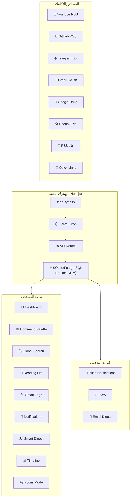

# 🚀 Orbita — تقرير شامل للمشروع

> **تاريخ التقرير:** 16 أغسطس 2026  
> **الحالة الراهنة:** المرحلة 3 مكتملة ✅ — في انتظار المرحلة 4

---

## 🎯 ما هو مشروع Orbita؟

**Orbita** هو **لوحة تحكم شخصية موحدة (Personal Intelligence Dashboard)** — تطبيق ويب يجمع كل مصادر المعلومات التي يتابعها المستخدم في مكان واحد ذكي ومنظم.

بدلاً من فتح تابات متعددة كل يوم (يوتيوب، جيتهاب، جيميل، أخبار، رياضة...)، **يجمعها Orbita في لوحة واحدة** مع إشعارات، بحث، وتنظيم متقدم.

### الفكرة الأساسية

```
المستخدم اليوم:        مع Orbita:
─────────────          ──────────────────────
YouTube Tab     →      
GitHub Tab      →      [ 🚀 Orbita Dashboard ]
Gmail Tab       →         ↓  كل شيء هنا  ↓
News Tab        →      
Sports Tab      →      
```

---

## 🏆 الهدف الأساسي من المشروع

| الجانب | التفاصيل |
|--------|----------|
| **الجمهور المستهدف** | المطورون، الطلاب، العمال عن بعد، أصحاب الأعمال |
| **المشكلة التي يحلها** | تشتت المعلومات عبر منصات متعددة وضياع الوقت |
| **الحل** | مركزة كل المصادر مع إشعارات ذكية وأدوات تنظيم |
| **نموذج العمل** | SaaS — Free / Pro ($9/شهر) / Enterprise ($29/شهر) |
| **التقنية** | Web App + PWA (قابل للتثبيت كتطبيق) |

---

## 🛠️ التقنيات المستخدمة

### الإطار والبنية الأساسية

| التقنية | الإصدار | الاستخدام |
|---------|---------|----------|
| **Next.js** | 16.2.3 | الإطار الرئيسي مع App Router |
| **React** | 19.2.4 | مكتبة الواجهة |
| **TypeScript** | ^5 | الحماية من الأخطاء وجودة الكود |

### قاعدة البيانات

| التقنية | الإصدار | الاستخدام |
|---------|---------|----------|
| **Prisma ORM** | ^5.22.0 | الطبقة بين الكود والقاعدة |
| **SQLite** | — | قاعدة بيانات مرحلة التطوير |
| **PostgreSQL** | — | المستهدف لمرحلة الإنتاج (Vercel) |

### التصميم والواجهة

| التقنية | الاستخدام |
|---------|----------|
| **TailwindCSS v4** | نظام التصميم والـ utilities |
| **CSS Variables** | ألوان Dark/Light Theme، ألوان المنصات |
| **Glassmorphism** | تأثيرات الزجاج على الـ Cards |
| **Google Fonts (Inter + Cairo)** | EN: Inter — AR: Cairo |
| **Lucide React** | أيقونات متسقة في كل التطبيق |

### الدولية والترجمة

| التقنية | الاستخدام |
|---------|----------|
| **next-intl** | نظام i18n كامل (EN + AR + RTL) |
| **next-themes** | إدارة Dark/Light Mode |

### خدمات جلب المحتوى

| التقنية | الاستخدام |
|---------|----------|
| **rss-parser** | جلب وتحليل RSS/Atom Feeds |
| **cheerio** | Web Scraping لاستخراج Open Graph |
| **web-push** | إرسال Push Notifications للمتصفح |
| **react-grid-layout** | Drag & Drop للـ Widgets (مُجهَّز) |

### البنية الخلفية (Backend)

| المكون | التفاصيل |
|--------|----------|
| **API Routes** | Next.js Route Handlers — 19 نقطة نهاية |
| **Session Auth** | JWT مخزن في HttpOnly Cookie |
| **Vercel Cron** | جدولة Cron Jobs لجلب المحتوى دورياً |
| **Service Worker** | Push Notifications للمتصفح |

---

## 🗄️ هيكل قاعدة البيانات (Prisma Schema)

تشمل القاعدة **10 نماذج (Models)** مترابطة:

```
User ──────┬── Workspace ── Feed ── FeedItem ── FeedItemTag ── Tag
           ├── Feed ─────── TelegramBot
           ├── Tag
           ├── AlertRule
           ├── GoogleToken (Gmail + Drive OAuth)
           └── PushSubscription
```

| النموذج | الغرض |
|--------|-------|
| `User` | حساب المستخدم + الإعدادات (ثيم، لغة، خطة الاشتراك) |
| `Workspace` | مساحات العمل (مجلدات للتنظيم) |
| `Feed` | المصادر (RSS, YouTube, GitHub, روابط سريعة...) |
| `FeedItem` | محتوى كل مصدر (مقالة، فيديو، commit، رسالة...) |
| `Tag` | وسوم المستخدم المخصصة |
| `FeedItemTag` | ربط العناصر بالوسوم (many-to-many) |
| `AlertRule` | قواعد التنبيه الذكي (IF keyword → THEN action) |
| `PushSubscription` | اشتراكات Push Notifications بالمتصفح |
| `GoogleToken` | رموز OAuth لـ Gmail و Google Drive |
| `TelegramBot` | ربط بوتات Telegram بالمصادر |

---

## 🗂️ هيكل المشروع

```
Orbita/
├── src/
│   ├── app/
│   │   ├── [locale]/                    # دعم i18n (en/ar)
│   │   │   ├── (dashboard)/             # صفحات الداشبورد المحمية
│   │   │   │   ├── overview/            # الصفحة الرئيسية
│   │   │   │   ├── feeds/               # إدارة المصادر
│   │   │   │   ├── workspaces/          # مساحات العمل
│   │   │   │   ├── notifications/       # الإشعارات
│   │   │   │   ├── reading-list/        # قائمة القراءة
│   │   │   │   ├── tags/                # الوسوم
│   │   │   │   ├── digest/              # الملخص الذكي
│   │   │   │   ├── status/              # حالة التكاملات
│   │   │   │   ├── analytics/           # الإحصائيات
│   │   │   │   └── settings/            # الإعدادات
│   │   │   ├── login/                   # صفحة الدخول
│   │   │   └── register/                # صفحة التسجيل
│   │   └── api/                         # API Routes (19 مجلد)
│   │       ├── auth/                    ← تسجيل الدخول/الخروج
│   │       ├── feeds/                   ← CRUD المصادر
│   │       ├── workspaces/              ← CRUD مساحات العمل
│   │       ├── notifications/           ← الإشعارات
│   │       ├── tags/                    ← الوسوم
│   │       ├── reading-list/            ← قائمة القراءة
│   │       ├── search/                  ← البحث الشامل
│   │       ├── timeline/                ← المخطط الزمني
│   │       ├── digest/                  ← الملخص الذكي
│   │       ├── analytics/               ← الإحصائيات
│   │       ├── alert-rules/             ← قواعد التنبيه
│   │       ├── cron/                    ← Cron Jobs
│   │       ├── gmail/                   ← Gmail API
│   │       ├── drive/                   ← Google Drive API
│   │       ├── telegram/                ← Telegram Bot
│   │       ├── sports/                  ← Sports APIs
│   │       ├── status/                  ← حالة النظام
│   │       ├── users/                   ← إدارة المستخدمين
│   │       └── webhooks/                ← Webhooks
│   ├── components/
│   │   ├── ui/                          # مكونات UI الأساسية
│   │   ├── feeds/                       # مكونات المصادر
│   │   ├── layout/                      # Sidebar + Header
│   │   ├── notifications/               # مكونات الإشعارات
│   │   ├── overview/                    # ويدجت الرئيسية
│   │   ├── reading-list/                # قائمة القراءة
│   │   ├── tags/                        # الوسوم
│   │   ├── focus/                       # وضع التركيز
│   │   └── workspaces/                  # مساحات العمل
│   ├── lib/
│   │   ├── auth.ts                      # منطق المصادقة
│   │   ├── session.ts                   # إدارة JWT Sessions
│   │   ├── prisma.ts                    # Prisma Client Singleton
│   │   ├── feed-source.ts              # كشف نوع الرابط تلقائياً
│   │   ├── focus-mode.ts               # منطق وضع التركيز
│   │   ├── dashboard-layout.ts         # إدارة تخطيط الداشبورد
│   │   └── pwa.ts                      # PWA utilities
│   └── services/
│       ├── feed-sync.ts                 # محرك المزامنة الرئيسي
│       ├── push-sender.ts               # إرسال Push Notifications
│       └── fetchers/
│           ├── rss.ts                   ← RSS Parser
│           ├── scraper.ts               ← Web Scraper (Cheerio)
│           ├── gmail.ts                 ← Gmail API
│           ├── drive.ts                 ← Google Drive API
│           ├── telegram.ts              ← Telegram Bot API
│           └── sports.ts               ← Sports APIs
├── prisma/
│   ├── schema.prisma                    # تعريف قاعدة البيانات
│   └── seed.ts                          # بيانات أولية
├── middleware.ts                         # Auth + i18n middleware
└── Documentation/
    ├── implementation_plan.md           # خطة التنفيذ الكاملة (19 ميزة)
    ├── task.md                          # قائمة المهام المحدَّثة
    └── manual-actions.md                # خطوات يدوية مطلوبة
```

---

## ✅ المراحل المنجزة

### Phase 1 — Foundation 🏗️ ✅ مكتملة 100%

| المهمة | الحالة |
|--------|--------|
| إنشاء مشروع Next.js + TypeScript + App Router | ✅ |
| نظام التصميم الكامل (CSS Variables, Dark/Light) | ✅ |
| ألوان المنصات (YouTube, GitHub, Telegram...) | ✅ |
| Typography: Inter (EN) + Cairo (AR) | ✅ |
| Glassmorphism + Gradient utilities | ✅ |
| RTL Support كامل للعربية | ✅ |
| مكونات UI: Button, Card, Input, Modal, Badge, Avatar, Tooltip, Skeleton, EmptyState, Toast | ✅ |
| Layout: Sidebar + Header + MainContent | ✅ |
| Prisma + SQLite + Schema كامل | ✅ |
| Seed data (مستخدم + مساحات افتراضية) | ✅ |
| الصفحات الأساسية (Overview, Feeds, Workspaces, Notifications, Settings) | ✅ |
| i18n كامل (EN + AR + تبديل فوري) | ✅ |
| Dark/Light Mode | ✅ |
| Sidebar Collapse + Responsive Mobile | ✅ |
| Build ناجح بدون أخطاء | ✅ |

---

### Phase 2 — Core ⚙️ ✅ مكتملة 100%

| المهمة | الحالة |
|--------|--------|
| CRUD Workspaces (إنشاء/تعديل/حذف/إعادة ترتيب) | ✅ |
| API: `/api/workspaces` كامل | ✅ |
| CRUD Feeds (إضافة/تعديل/حذف) | ✅ |
| API: `/api/feeds` كامل | ✅ |
| كشف تلقائي لنوع الرابط (YouTube, GitHub, Facebook...) | ✅ |
| جلب Favicons تلقائياً | ✅ |
| مكون FeedCard مع Preview | ✅ |
| Quick Links (Facebook, WhatsApp, أي موقع) | ✅ |
| ⌨️ Command Palette (Ctrl+K) مع Fuzzy Search | ✅ |
| ⌨️ Keyboard Shortcuts أساسية | ✅ |
| 📑 Reading List (حفظ للقراءة لاحقاً) | ✅ |
| 🏷️ Smart Tags (CRUD + ربط بالعناصر) | ✅ |
| 📌 Pinned Feeds | ✅ |
| نظام المصادقة الكامل (Login/Register + Session JWT) | ✅ |
| صفحات Login + Register | ✅ |
| Middleware حماية المسارات | ✅ |

---

### Phase 3 — Content & Notifications 🔔 ✅ مكتملة 100%

| المهمة | الحالة |
|--------|--------|
| 🔴 YouTube RSS Integration | ✅ |
| 🐙 GitHub RSS + Webhooks | ✅ |
| RSS Parser عام للأخبار والمدونات | ✅ |
| Web Scraper (Cheerio) لـ Open Graph | ✅ |
| Cron Jobs (Vercel Cron) لجلب دوري | ✅ |
| محرك المزامنة الرئيسي (feed-sync.ts) | ✅ |
| نظام الإشعارات الداخلي (CRUD) | ✅ |
| NotificationBell في Header مع Badge | ✅ |
| Push Notifications (Service Worker + web-push) | ✅ |
| 📬 Smart Digest (يومي/أسبوعي) | ✅ |
| 📊 Activity Timeline | ✅ |
| 🔍 Global Search | ✅ |
| 📝 Notes & Annotations على FeedItems | ✅ |
| ✈️ Telegram Bot Service (fetcher جاهز) | ✅ |
| 📧 Gmail Service (fetcher جاهز) | ✅ |
| 📁 Google Drive Service (fetcher جاهز) | ✅ |
| ⚽ Sports API Service (fetcher جاهز) | ✅ |

---

## ⏳ المراحل المتبقية

### Phase 4 — Advanced 🔌 (التالية)

> **الحالة:** لم تبدأ بعد — هي المرحلة القادمة مباشرة

| المهمة | الأولوية |
|--------|----------|
| ✈️ ربط Telegram Bot بالواجهة (UI كامل) | 🔴 عالية |
| 📧 Gmail Integration UI + OAuth Flow | 🔴 عالية |
| 📁 Google Drive Integration UI | 🟡 متوسطة |
| ⚽ Sports APIs Widget | 🟡 متوسطة |
| 🎓 Onboarding Wizard متعدد الخطوات | 🟡 متوسطة |
| 🧩 Drag & Drop Widgets (react-grid-layout جاهز) | 🟡 متوسطة |
| 🎧 Focus Mode (البنية جاهزة في lib/) | 🟢 منخفضة |
| 🟢 Status Page (حالة كل تكامل) | 🟡 متوسطة |
| 🚨 Custom Alert Rules (قاعدة البيانات جاهزة) | 🔴 عالية |
| 📈 Analytics Dashboard (مع Recharts) | 🟡 متوسطة |
| ⌨️ Keyboard Shortcuts المتقدمة | 🟢 منخفضة |
| 📱 PWA (manifest + service worker) | 🟡 متوسطة |

---

### Phase 5 — Market Ready 🚀 (المستقبل القريب)

| المهمة | الملاحظات |
|--------|-----------|
| نظام الاشتراكات (Stripe: Free/Pro/Enterprise) | Feature gating حسب الخطة |
| Landing Page تسويقية | Hero, Features, Pricing, CTA |
| Export Reports (PDF/CSV) | Enterprise فقط |
| Browser Extension | Pro + Enterprise |
| Webhook/Zapier Integration | Enterprise فقط |
| Email Digest (Resend/SendGrid) | Pro + Enterprise |
| Team Features (مشاركة + أدوار) | Enterprise فقط |
| Facebook Graph API | Enterprise فقط |
| API Documentation (Swagger) | للمطورين |
| Deploy على Vercel + Custom Domain | الإطلاق الرسمي |
| Privacy Policy + Terms of Service | مطلوب قانونياً |

---

### Phase 6 — Future Evolution 🔮 (خارطة الطريق)

| الميزة | التقنية المقترحة |
|--------|-----------------|
| 🤖 AI Summary لكل FeedItem | OpenAI API / Google Gemini |
| 🤖 AI Auto-Tag ذكي | OpenAI API / Local ML |
| 📊 Team Analytics | Recharts + Team DB |
| 📱 Mobile App | React Native + Expo |
| 🔄 Content Scheduling | Calendar APIs |
| 💬 In-App Chat | WebSocket |
| 📋 Kanban Board | Drag & Drop |

---

## 📊 ملخص الميزات الكاملة (19 ميزة + الأساسيات)

### ⚙️ الميزات الأساسية (للجميع)

| # | الميزة | الحالة |
|---|--------|--------|
| — | CRUD Feeds + Workspaces | ✅ منجزة |
| — | كشف تلقائي للروابط + Favicons | ✅ منجزة |
| — | Quick Links (FB, WA, أي موقع) | ✅ منجزة |
| — | Dark / Light Mode | ✅ منجزة |
| — | العربي + الإنجليزي (i18n + RTL) | ✅ منجزة |
| — | YouTube RSS | ✅ منجزة |
| — | GitHub RSS | ✅ منجزة |
| — | News/Sports RSS عام | ✅ منجزة |
| — | إشعارات داخلية | ✅ منجزة |
| — | Push Notifications | ✅ منجزة |
| — | نظام المصادقة | ✅ منجزة |

### ⭐ الميزات المتقدمة

| # | الميزة | الخطة | الحالة |
|---|--------|-------|--------|
| 1 | ⌨️ Command Palette | الكل | ✅ منجزة |
| 2 | 📑 Reading List | Free (10) / Pro (∞) | ✅ منجزة |
| 3 | ⌨️ Keyboard Shortcuts | أساسي ✅ / متقدم ⏳ | جزئي |
| 4 | 🏷️ Smart Tags | Free (5) / Pro (∞) | ✅ منجزة |
| 5 | 📌 Pinned Feeds | Free (3) / Pro (∞) | ✅ منجزة |
| 6 | 📝 Notes & Annotations | Free (10) / Pro (∞) | ✅ منجزة |
| 7 | 📬 Smart Digest | أسبوعي ✅ / يومي ✅ | ✅ منجزة |
| 8 | 📊 Activity Timeline | 24h / ∞ | ✅ منجزة |
| 9 | 🔍 Global Search | الكل | ✅ منجزة |
| 10 | ✈️ Telegram Bot | Pro فقط | ⏳ (fetcher جاهز) |
| 11 | 📧 Gmail Integration | Pro فقط | ⏳ (fetcher جاهز) |
| 12 | 📁 Google Drive | Pro فقط | ⏳ (fetcher جاهز) |
| 13 | ⚽ Sports APIs | Pro فقط | ⏳ (fetcher جاهز) |
| 14 | 🎧 Focus Mode | Pro فقط | ⏳ (lib جاهز) |
| 15 | 🧩 Drag & Drop Widgets | Pro فقط | ⏳ (مكتبة مثبتة) |
| 16 | 🚨 Custom Alert Rules | Pro فقط | ⏳ (DB جاهز) |
| 17 | 📈 Analytics Dashboard | أساسي / كامل | ⏳ |
| 18 | 🟢 Status Page | الكل | ⏳ |
| 19 | 🎓 Onboarding Wizard | الكل | ⏳ |

---

## 💰 نموذج التسعير

```
┌──────────────┬──────────────────┬──────────────────────┐
│  🆓 Free      │     ⭐ Pro        │    🏢 Enterprise      │
│  $0/month    │   $9/month       │   $29/month          │
├──────────────┼──────────────────┼──────────────────────┤
│ 5 Feeds      │ ∞ Feeds          │ ∞ Feeds              │
│ 2 Workspaces │ ∞ Workspaces     │ ∞ Workspaces         │
│ 10 ملاحظات   │ ∞ ملاحظات        │ ∞ ملاحظات            │
│ 3 مثبتة      │ ∞ مثبتة          │ ∞ مثبتة              │
│ 50 إشعار     │ ∞ إشعارات        │ ∞ إشعارات            │
│              │ Telegram/Gmail   │ + Team Features      │
│              │ Google Drive     │ + API Access         │
│              │ Focus Mode       │ + Export Reports     │
│              │ Alert Rules      │ + Webhooks/Zapier    │
│              │ Drag & Drop      │ + Custom Branding    │
└──────────────┴──────────────────┴──────────────────────┘
```

---

## 🏛️ المعمارية العامة



---

## 📌 الخلاصة السريعة

| العنصر | التفاصيل |
|--------|----------|
| **المرحلة الحالية** | بعد Phase 3 ✅ |
| **الميزات المنجزة** | Foundation كامل + Core كامل + Content كامل |
| **API Routes جاهزة** | 19 نقطة نهاية مكتملة |
| **نماذج DB** | 10 نماذج مترابطة |
| **لغات الدعم** | العربية + الإنجليزية (RTL/LTR) |
| **الثيمات** | Dark + Light |
| **التالي** | Phase 4 — Advanced (Telegram UI, Gmail UI, Alert Rules, Analytics, PWA) |
| **الهدف النهائي** | SaaS منتشر على Vercel مع 3 خطط تسعير |

> [!TIP]
> الأولوية القادمة هي **إتمام واجهات التكاملات الجاهزة** (Telegram, Gmail, Drive) ثم **نظام Alert Rules** ثم **Analytics Dashboard** — لأن الـ fetchers والـ APIs موجودة بالفعل، المتبقي هو الواجهة فقط.
